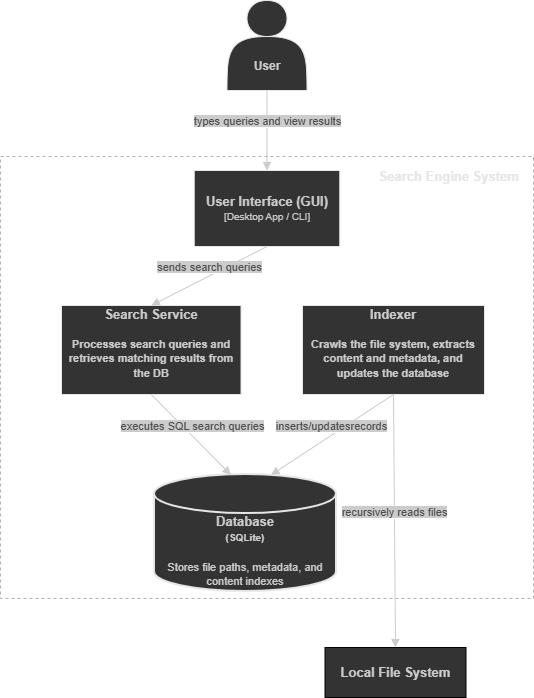

# Local File Search System - Architecture

This document presents the architecture of the Local File Search Engine. The system allows users to search files on their local machine using file name, content, and metadata.

The architecture is described using the C4 model to provide a clear and structured view of the system.

## 1. System Context (C4 Level 1)
The system context diagram illustrates the interaction between the user and the local file search engine. The user submits search queries to the system, which processes them by accessing data from the local file system. The system indexes file content and metadata to provide relevant search results.

  

### Actor

- **User**  
  The primary actor who interacts with the system to perform file searches and view results.

### External Dependencies
- **Database Management System (DBMS)**  
  Stores indexed file data and supports query processing. The system uses PostgreSQL as the database, which plays a key role in enabling fast and reliable search operations.

- **Operating System File System**  
  Provides access to files, directories, and metadata that are read and indexed by the system. 

### Interactions

- The **User** submits search queries through the **User Interface**.
- The **System** processes queries using indexed data.
- The **System** reads files and metadata from the **Local File System**.
- The **System** stores and retrieves indexed data using a **Database Management System**.
- The **System** returns relevant search results, including basic file previews, to the **User**.

## 2. Container (C4 Level 2)
The container diagram illustrates the main building blocks of the Local File Search Engine and how they interact. It shows how user requests are handled, how data is indexed from the local file system, and how search operations are performed using the database.

  

* **User Interface (GUI / CLI)**
  Provides the interaction layer between the user and the system. It allows users to enter search queries and view the returned results, forwarding requests to the search service.

* **Search Service**
  Handles search requests from the user interface. It queries the indexed data stored in the database, retrieves matching files, and prepares the results.

* **Indexer**
  Responsible for building and maintaining the searchable data. It crawls the local file system, extracts file content and metadata, and stores the processed information in the database.

* **Database**
  Stores indexed file data such as file paths, content, and metadata. It supports efficient query processing and plays an important role in retrieving search results.

### External Dependency

* **Local File System**
  Acts as the source of data for the system, providing access to files and metadata that are read and indexed by the indexer.
