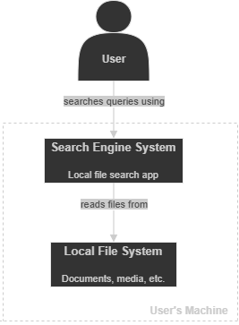
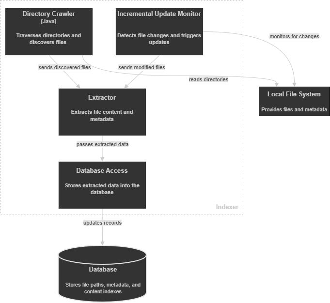
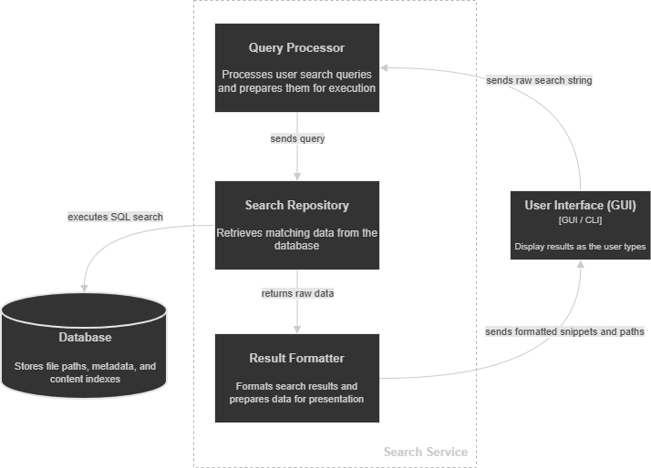

# Local File Search System - Architecture

This document presents the architecture of the Local File Search Engine. The system allows users to search files on their local machine using file name, content, and metadata.

The architecture is described using the C4 model to provide a clear and structured view of the system.

## 1. System Context (C4 Level 1)
The system context diagram illustrates the interaction between the user and the local file search engine. The user submits search queries to the system, which processes them by accessing data from the local file system. The system indexes file content and metadata to provide relevant search results.

  

### Actor

- **User**  
  The primary actor who interacts with the system to perform file searches and view results.

### External Dependencies
- **Database Management System (DBMS)**  
  Stores indexed file data and supports query processing. The system uses SQLite as the database, which plays a key role in enabling fast and reliable search operations.

- **Operating System File System**  
  Provides access to files, directories, and metadata that are read and indexed by the system. 

### Interactions

- The **User** submits search queries through the **User Interface**.
- The **System** processes queries using indexed data.
- The **System** reads files and metadata from the **Local File System**.
- The **System** stores and retrieves indexed data using a **Database Management System**.
- The **System** returns relevant search results, including basic file previews, to the **User**.

## 2. Container (C4 Level 2)
The container diagram illustrates the main building blocks of the Local File Search Engine and how they interact. It shows how user requests are handled, how data is indexed from the local file system, and how search operations are performed using the database.

  

* **User Interface (GUI / CLI)**
  Provides the interaction layer between the user and the system. It allows users to enter search queries and view the returned results, forwarding requests to the search service.

* **Search Service**
  Handles search requests from the user interface. It queries the indexed data stored in the database, retrieves matching files, and prepares the results.

* **Indexer**
  Responsible for building and maintaining the searchable data. It crawls the local file system, extracts file content and metadata, and stores the processed information in the database.

* **Database**
  Stores indexed file data such as file paths, content, and metadata. It supports efficient query processing and plays an important role in retrieving search results.

### External Dependency

* **Local File System**
  Acts as the source of data for the system, providing access to files and metadata that are read and indexed by the indexer.

## 3. Component (C4 Level 3)

The component diagrams present the internal structure of the main containers in the system. They show how responsibilities are divided between components and how these components collaborate to perform indexing and search operations.

## Indexer Components

  

### Components

* **Directory Crawler**
  Traverses the local file system and discovers files and directories to be processed.

* **Extractor**
  Processes discovered files and extracts relevant content and metadata required for indexing.

* **Database Access**
  Handles storing extracted data in the database and managing interactions with the storage layer.

* **Incremental Update Monitor (Optional)**
  Observes changes in the file system and triggers updates to keep indexed data consistent.

### Interactions

* The Directory Crawler reads data from the local file system.
* The Extractor receives discovered files and processes their content and metadata.
* The Database Access component stores indexed data in the SQLite database.
* The Incremental Update Monitor detects file changes and triggers reprocessing when needed.

---

## Search Service Components

  

### Components

* **Query Processor**
  Processes user search queries and prepares them for execution.

* **Search Repository**
  Retrieves matching data from the database based on processed queries.

* **Result Formatter**
  Formats search results and prepares them for presentation to the user.

### Interactions

* The User Interface sends search queries to the Query Processor.
* The Query Processor forwards processed queries to the Search Repository.
* The Search Repository retrieves matching results from the SQLite database.
* The Result Formatter prepares the results and sends them back to the User Interface.

## 4. Class Diagram (C4 Level 4)

The final level of the C4 model focuses on the internal structure of components, describing the system in terms of classes and their relationships.

Since this level represents low-level design closely tied to the implementation, it will be developed gradually throughout the project iterations.