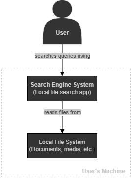

# Local File Search System - Architecture

This document presents the architecture of the Local File Search Engine. The system allows users to search files on their local machine using file name, content, and metadata.

The architecture is described using the C4 model to provide a clear and structured view of the system.

## 1. System Context
The system context diagram illustrates the interaction between the user and the local file search engine. The user submits search queries to the system, which processes them by accessing data from the local file system. The system indexes file content and metadata to provide relevant search results.

### Actor

- **User**  
  The primary actor who interacts with the system to perform file searches and view results.

### External Dependencies
- **Database Management System (DBMS)**  
  Stores indexed file data and supports query processing. The system uses PostgreSQL as the database, which plays a key role in enabling fast and reliable search operations.

- **Operating System File System**  
  Provides access to files, directories, and metadata that are read and indexed by the system. 

### Interactions

- The **User** submits search queries through the **User Interface**.
- The **System** processes queries using indexed data.
- The **System** reads files and metadata from the **Local File System**.
- The **System** stores and retrieves indexed data using a **Database Management System**.
- The **System** returns relevant search results, including basic file previews, to the **User**.